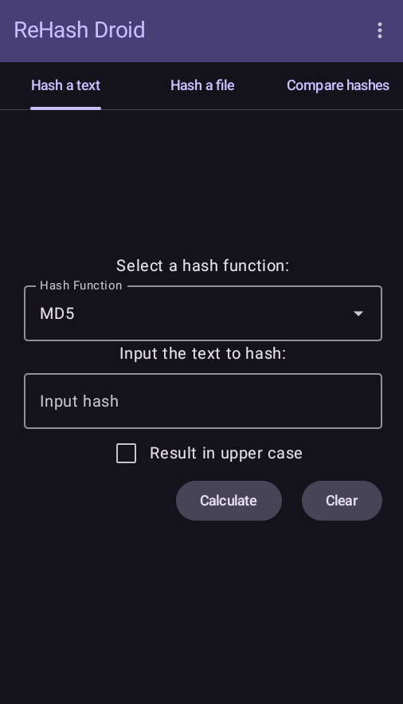
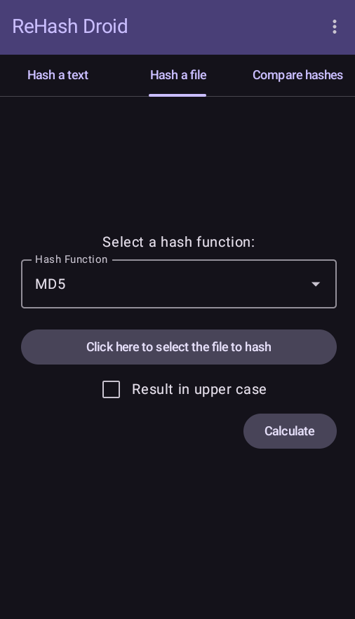
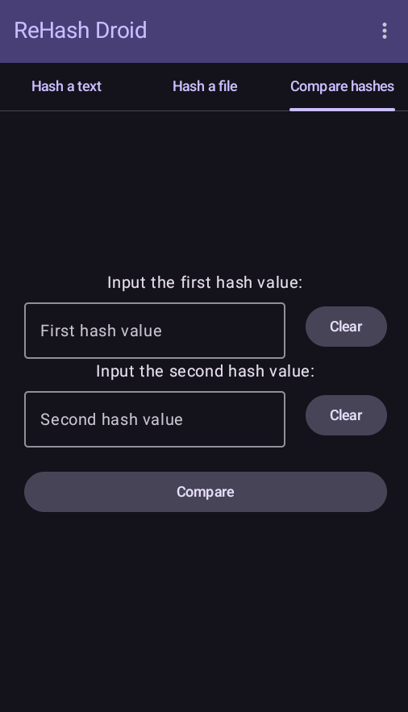

## ReHashDroid (Fully Working)

Jetpack Compose and Kotlin remake of [Hash Droid](https://github.com/HobbyOneDroid/HashDroid)

Check the integrity of text, files, and compare hashes.

See images below for an overview

Supports the same as Hash Droid:

- Adler-32
- CRC-32
- Haval-128
- MD2
- MD4
- MD5
- RIPEMD-128
- RIPEMD-160
- SHA-1
- SHA-256
- SHA-384
- SHA-512
- Tiger
- Whirlpool
